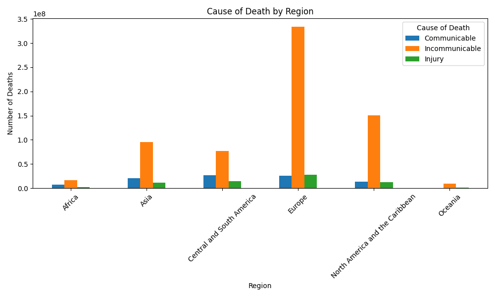
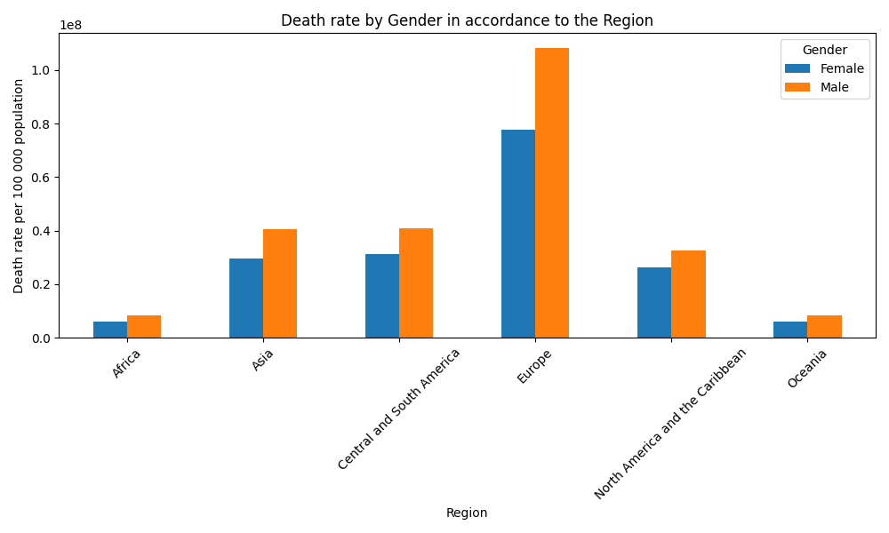

# WHO Mortality Data Analysis

This project analyzes mortality data from the World Health Organization (WHO), focusing on deaths by cause, age group, region, and gender. The analysis uses Python, pandas for data manipulation, and matplotlib for visualization.

---

## Table of Contents
1. [Project Description](#project-description)
2. [Data Sources](#data-sources)
3. [Data Cleaning and Processing](#data-cleaning-and-processing)
4. [Analysis and Visualization](#analysis-and-visualization)
5. [Exported Graphs](#exported-graphs)
6. [Requirements](#requirements)
7. [Usage](#usage)
8. [Output](#output)
9. [Data Preparation for Modeling](#data-preparation-for-modeling)
10. [Model Generation](#model-generation)

---

## Project Description
The code processes multiple WHO mortality datasets, cleans the data, and generates visualizations to understand trends in mortality across different causes, age groups, regions, and genders.

---

## Data Sources
The analysis uses the following datasets:

- `Injury` deaths CSV
- `Communicable, maternal, perinatal and nutritional conditions` CSV
- `Noncommunicable diseases` CSV

All CSVs are expected to be in the `./data/` folder.

---

## Data Cleaning and Processing
Steps performed on the datasets:

1. Combine multiple CSV files into a single dataframe.
2. Remove rows with more than one missing value and fill single missing values with 0.
3. Strip and clean column names.
4. Keep only male and female data (exclude 'All').
5. Add an `ID` column as the index.
6. Convert the death rate column to numeric.
7. Remove duplicates.
8. Map age groups to broader bins (`0-20`, `21-40`, `41-60`, `61-80`, `81+`).
9. Map years to broader decades (`1961-1970`, `1971-1980`, etc.).

---

## Analysis and Visualization
The following visualizations are generated:

1. **Cause of Death by Broad Age Group**
   - Pivoted data by age group and cause of death.
   - Graph Type: Line chart
   - Saved as: `Cause_of_death_by_Broad_Age_group.png`

     
   

2. **Cause of Death by Region**
   - Pivoted data by region and cause of death.
   - Graph Type: Bar chart
   - Saved as: `Cause of Death by region.png`

     
   *Paste your exported graph here.*

3. **Death Rate by Gender**
   - Pivoted data by gender.
   - Graph Type: Bar chart
   - Saved as: `Death rate by Gender.png`

     
   

4. **Death Rate by Year**
   - Pivoted data by year and cause of death.
   - Graph Type: Bar chart
   - Saved as: `death rate by Year.png`

     
  

5. **Death Rate by Year in Accordance to Gender**
   - Pivoted data by year and gender.
   - Graph Type: Bar chart
   - Saved as: `death rate by Year in accordance to Gender.png`

   

---

## Requirements
- Python 3.x
- pandas
- matplotlib
- re (built-in)

Install dependencies using:

```bash
pip install pandas matplotlib 


## Data Preparation for Modeling

The `data_model.py` script demonstrates how to load the cleaned dataset (`data/output/data.csv`) and prepare it for predictive modeling.

Steps performed in the script:

1. **Set up directories**  
   The script identifies the base directory, data folder, and output folder to ensure paths work regardless of the system.

2. **Load the cleaned dataset**  
   ```python
   import pandas as pd
   import os

   BASE_DIR = os.path.dirname(os.path.abspath(__file__))
   DATA_DIR = os.path.join(BASE_DIR, 'data')
   OUTPUT_DIR = os.path.join(DATA_DIR, 'output')

   df_data = pd.read_csv(os.path.join(OUTPUT_DIR, 'data.csv'))

