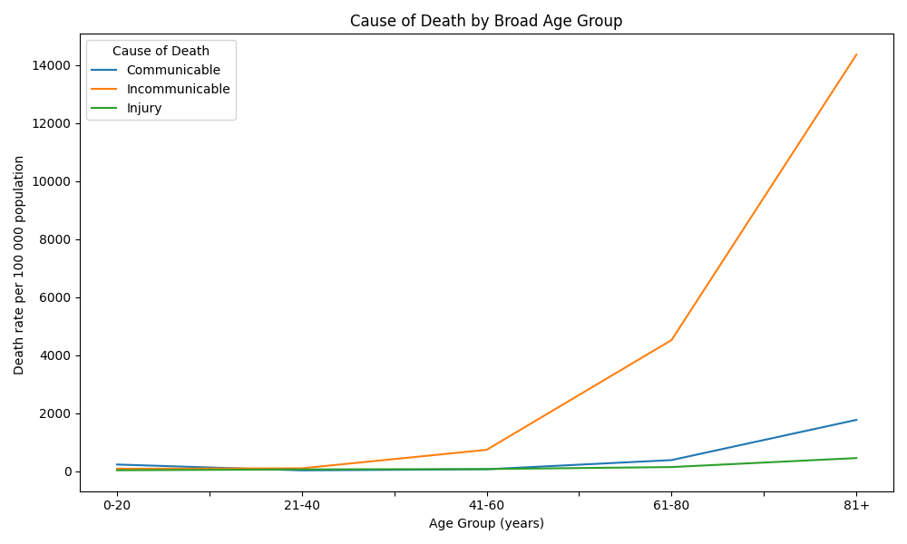
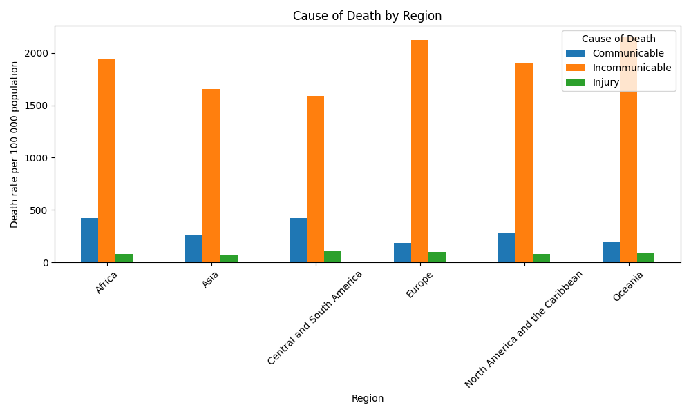
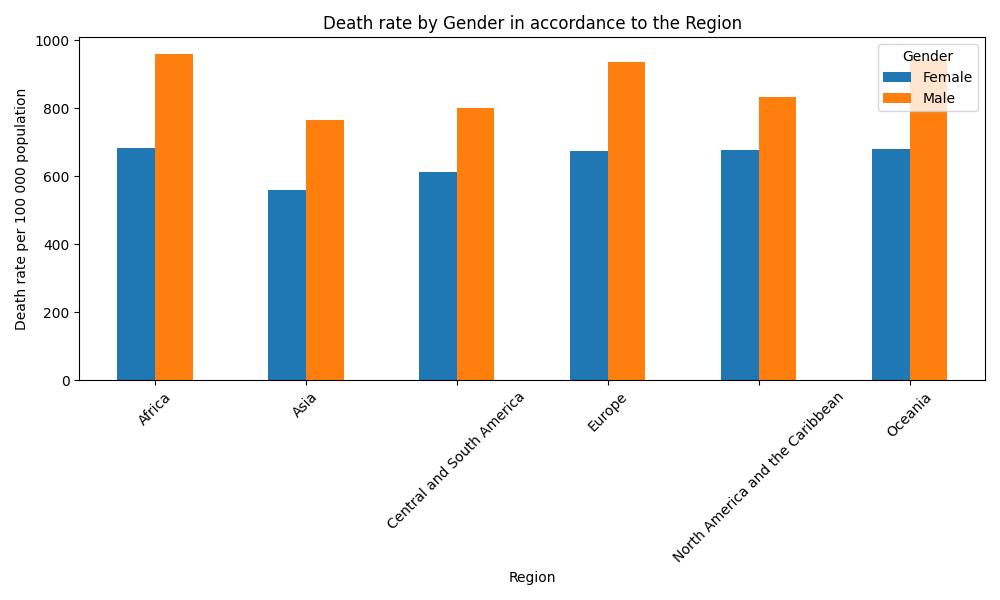
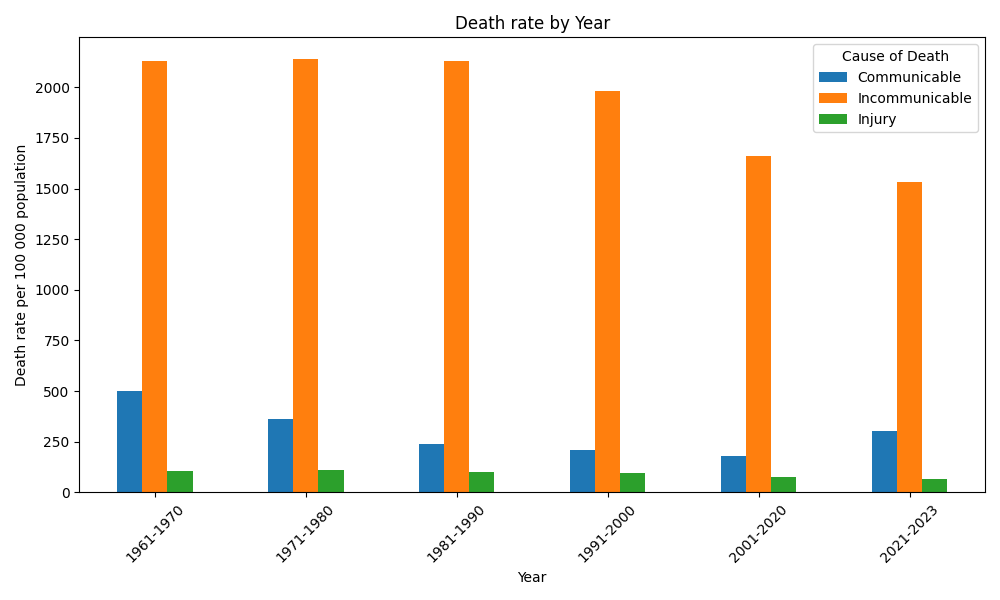
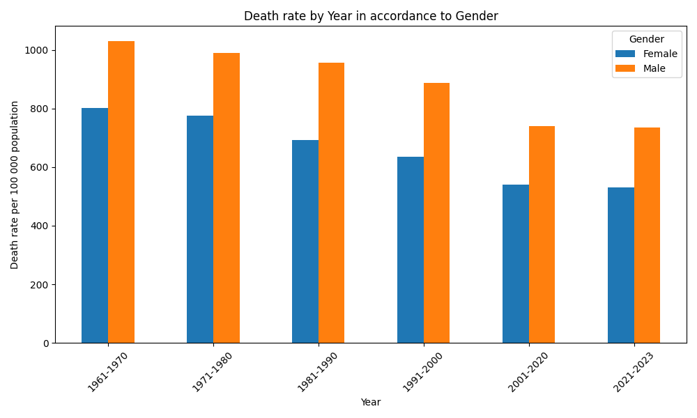

# WHO Mortality Data Analysis

This project analyzes mortality data from the World Health Organization (WHO), focusing on deaths by cause, age group, region, and gender. The analysis uses Python, pandas for data manipulation, and matplotlib for visualization.

---

## Table of Contents
1. [Project Description](#project-description)
2. [Data Sources](#data-sources)
3. [Data Cleaning and Processing](#data-cleaning-and-processing)
4. [Analysis and Visualization](#analysis-and-visualization)
5. [Exported Graphs](#exported-graphs)
6. [Data Preparation for Modeling](#data-preparation-for-modeling)
7. [Model Generation](#model-generation)
8. [Requirements](#requirements)

---

## Project Description
The code processes multiple WHO mortality datasets, cleans the data, and generates visualizations to understand trends in mortality across different causes, age groups, regions, and genders.

---

## Data Sources
The analysis uses the following datasets:

- `Injury` deaths CSV
- `Communicable, maternal, perinatal and nutritional conditions` CSV
- `Noncommunicable diseases` CSV

All CSVs are expected to be in the `./data/` folder.

---

## Data Cleaning and Processing
Steps performed on the datasets:

1. Combine multiple CSV files into a single dataframe.
2. Remove rows with more than one missing value and fill single missing values with 0.
3. Strip and clean column names.
4. Keep only male and female data (exclude 'All').
5. Add an `ID` column as the index.
6. Convert the death rate column to numeric.
7. Remove duplicates.
8. Map age groups to broader bins (`0-20`, `21-40`, `41-60`, `61-80`, `81+`).
9. Map years to broader decades (`1961-1970`, `1971-1980`, etc.).

---

## Analysis and Visualization
The following visualizations are generated:

## Exported Graphs

1. **Cause of Death by Broad Age Group**
   - Pivoted data by age group and cause of death.
   - Graph Type: Line chart
   - Saved as: `Cause_of_death_by_Broad_Age_group.png`

     
   

2. **Cause of Death by Region**
   - Pivoted data by region and cause of death.
   - Graph Type: Bar chart
   - Saved as: `Cause of Death by region.png`

     
   *Paste your exported graph here.*

3. **Death Rate by Gender**
   - Pivoted data by gender.
   - Graph Type: Bar chart
   - Saved as: `Death rate by Gender.png`

     
   

4. **Death Rate by Year**
   - Pivoted data by year and cause of death.
   - Graph Type: Bar chart
   - Saved as: `death rate by Year.png`

     
  

5. **Death Rate by Year in Accordance to Gender**
   - Pivoted data by year and gender.
   - Graph Type: Bar chart
   - Saved as: `death rate by Year in accordance to Gender.png`

   


## Data Preparation for Modeling

1. **Data Loading**: The cleaned data.csv file is loaded as the primary dataset.  
2. **Feature and Target Selection**: The script identifies the input features (Age Group, Region Name, Year, Sex, Cause) and the target variable (Numbers of deaths).  
3. **One-Hot Encoding**: Categorical features are converted into a numerical format suitable for machine learning algorithms using one-hot encoding.  
4. **Data Splitting**: The dataset is split into training and testing sets to evaluate the model's performance on unseen data.


## Model Generation

The model\_generation.py script continues with the following steps to generate the predictive model:

1. **Model Training**: A RandomForestRegressor model is trained on the training data. This model is chosen for its robustness and ability to handle complex feature interactions.  
2. **Model Evaluation**: The model's predictions on the test set are evaluated using two key metrics:  
   * **Mean Squared Error (MSE)**: Measures the average squared difference between the actual and predicted values.  
   * **R-squared (**R2**)**: Represents the proportion of the variance in the dependent variable that is predictable from the independent variables.


## Requirements
- Python 3.x
- pandas
- matplotlib
- re (built-in)

Install dependencies using:

```bash
pip install pandas matplotlib 
pip install pandas matplotlib scikit-learn


<iframe width="600" height="450" src="https://lookerstudio.google.com/embed/reporting/4b4ffb2c-a883-40c0-8738-53d89250cd63/page/sLEXF" frameborder="0" style="border:0" allowfullscreen sandbox="allow-storage-access-by-user-activation allow-scripts allow-same-origin allow-popups allow-popups-to-escape-sandbox"></iframe>


